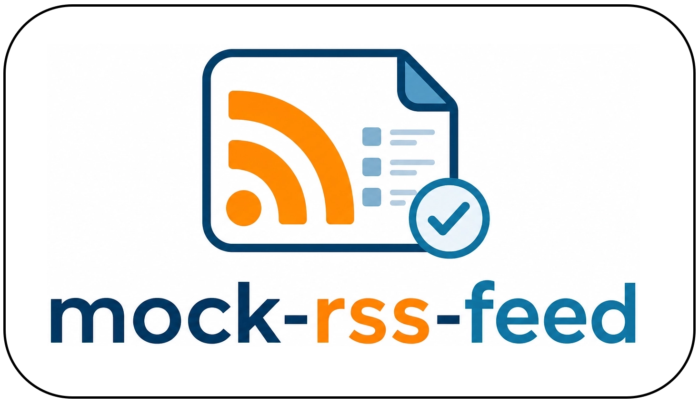

<p align="center">
  
</p>

<h1 align="center">Mock RSS Feed Service</h1>

<p align="center">
  Spin up realistic, domain-aware RSS/Atom feeds on demand — perfect for demos,
  integration testing, and prototyping feed consumers.
</p>

<p align="center">
  
  
  
</p>

---

## Overview

Mock RSS Feed Service is a small [FastAPI](https://fastapi.tiangolo.com/) app
that lets you create mock RSS/Atom feeds at runtime. Each feed belongs to a
**domain** (financial, news, weather, and more) and produces fresh,
domain-appropriate items on every poll — simulating a live, continuously updating
feed.

It is designed for **short-lived demos (≤60 minutes)**: everything is held in a
TTL cache (in-memory by default, or any Redis-compatible store such as
[Aiven for Valkey](https://aiven.io/valkey)) and self-expires, so there is
nothing to clean up between sessions.

### Highlights

- **Runtime-defined feeds** — create feeds via a REST call; each gets its own URL.
- **Seven built-in domains** — financial, news, weather, sports, ecommerce, iot, social.
- **Continuous streams** — items are generated on the fly at a configurable average
  rate with natural jitter, so a feed looks alive across polls.
- **RSS 2.0 and Atom** — choose per request via query parameter or `Accept` header.
- **Pluggable cache** — in-memory out of the box; point at Redis/Valkey with one env var.
- **Zero persistence** — TTL-based expiry means no database and no cleanup.

---

## Quick start

```bash
uv sync
PORT=8000 uv run python -m app.main
```

The service is now running at `http://localhost:8000`. Try:

```bash
curl -s http://localhost:8000/healthz      # {"status":"ok"}
curl -s http://localhost:8000/domains      # list available domains
```

> **Note:** the app binds port **80** by default (as expected by Aiven Apps).
> Locally, set `PORT=8000` (or any non-privileged port) to avoid needing root.

---

## Walkthrough

### 1. Mint an API key

Creating feeds requires an API key. Minting one is open and only needs an email:

```bash
curl -sX POST http://localhost:8000/keys \
  -H 'content-type: application/json' \
  -d '{"email":"you@example.com","label":"my-demo"}'
```

```json
{
  "api_key": "H8s3...redacted...9kQ",
  "expires_at": "2026-07-14T13:00:00+00:00"
}
```

The key gates feed **creation** only — reading a feed is always open. The key
expires on the same TTL as feeds.

### 2. Create a feed

```bash
curl -sX POST http://localhost:8000/feeds \
  -H "X-API-Key: <your-key>" \
  -H 'content-type: application/json' \
  -d '{
    "domain": "financial",
    "title": "ACME Markets",
    "interval_seconds": 30,
    "variance_pct": 20,
    "params": { "tickers": ["AAPL", "MSFT", "NVDA"] }
  }'
```

```json
{
  "feed_id": "k3Jd9aQ1",
  "path": "/feeds/k3Jd9aQ1",
  "expires_at": "2026-07-14T13:00:00+00:00"
}
```

### 3. Poll the feed

RSS 2.0 is returned by default:

```bash
curl -s http://localhost:8000/feeds/k3Jd9aQ1
```

Request Atom via query parameter or `Accept` header:

```bash
curl -s "http://localhost:8000/feeds/k3Jd9aQ1?format=atom"
curl -s http://localhost:8000/feeds/k3Jd9aQ1 -H "Accept: application/atom+xml"
```

Each poll returns the items generated since your last poll, so repeated requests
show a steadily advancing stream.

### 4. Delete a feed (optional)

```bash
curl -sX DELETE http://localhost:8000/feeds/k3Jd9aQ1   # 204 No Content
```

---

## Domains

| Domain | Example content | Notable params |
|---|---|---|
| `financial` | Ticker price moves | `tickers` |
| `news` | Headlines by section | `sections` |
| `weather` | City conditions | `cities` |
| `sports` | Match scores | `leagues` |
| `ecommerce` | Order events | `currency` |
| `iot` | Sensor readings | `sensors` |
| `social` | Social posts | `hashtags` |

Call `GET /domains` to discover each domain's overridable params and its default
category pool:

```bash
curl -s http://localhost:8000/domains | jq
```

**Adding your own domain is easy** — one small self-registering file, no other
wiring. See [`app/domains/README.md`](app/domains/README.md) for the
`DomainGenerator` interface and a worked example.

### Categories

Every item carries a realistic mix of `<category>` tags. Each domain has a default
category pool; override it per feed with a top-level `categories` array:

```bash
curl -sX POST http://localhost:8000/feeds \
  -H "X-API-Key: <your-key>" \
  -H 'content-type: application/json' \
  -d '{"domain":"news","categories":["crypto","defi","macro"]}'
```

---

## How feeds work

- **On-the-fly generation.** Each `GET /feeds/{id}` synthesizes the items that
  "occurred" in the window since your previous poll — content is never stored.
- **Average rate + jitter.** Items are produced roughly every `interval_seconds`,
  randomized by `± variance_pct`, so spacing looks organic rather than mechanical.
- **Seeded backlog.** The first poll of a new feed returns a backlog spanning the
  full TTL window, so a fresh feed already looks like it has been running for the
  whole demo.
- **Self-expiry.** Feeds and keys share a TTL and vanish automatically; polling a
  feed never extends its lifetime.

> **These are streaming simulations, not stable RSS documents.** Each poll returns
> only the items generated since your previous poll, and item GUIDs are unique per
> poll — a feed reader will see every item as new each time rather than deduping
> against earlier fetches. Note also that a poll gap larger than
> `MAX_ITEMS_PER_RESPONSE × interval_seconds` discards the surplus (only the most
> recent items are returned). For reproducible, assertion-friendly output, a
> deterministic mode is planned (see below).

---

## API reference

| Method | Path | Auth | Description |
|---|---|---|---|
| `POST` | `/keys` | — | Mint an API key. Body: `{ "email", "label"? }`. |
| `POST` | `/feeds` | API key | Create a feed. Returns `feed_id` and its path. |
| `GET` | `/feeds/{id}` | — | Poll a feed (RSS 2.0 or Atom). |
| `DELETE` | `/feeds/{id}` | — | Remove a feed early. |
| `GET` | `/domains` | — | List domains and their params. |
| `GET` | `/healthz` | — | Liveness check. |

**Feed creation fields:** `domain` (required), `title`, `description`,
`interval_seconds`, `variance_pct`, `categories`, and domain-specific `params`.

---

## Configuration

All configuration is via environment variables:

| Variable | Default | Purpose |
|---|---|---|
| `PORT` | `80` | Port to bind. Aiven Apps uses 80; set `PORT=8000` locally. |
| `PUBLIC_BASE_URL` | *(unset)* | Base URL for absolute links in feed XML. Falls back to the forwarded request scheme + host. |
| `FEED_TTL_SECONDS` | `3600` | Cache TTL, and the size of the first-poll seed window. |
| `REDIS_URL` | *(unset)* | Redis-compatible connection URL (e.g. Aiven for Valkey `rediss://…`). When set, the Redis backend is used automatically; otherwise the in-memory backend is used. |
| `MAX_FEEDS` / `MAX_KEYS` | `100` | Capacity of the in-memory backend. |
| `DEFAULT_INTERVAL_SECONDS` | `30` | Default mean seconds between items. |
| `DEFAULT_VARIANCE_PCT` | `20` | Default jitter around the mean rate. |
| `MAX_ITEMS_PER_RESPONSE` | `200` | Upper bound on items returned per poll. |
| `ENABLED_DOMAINS` | *(all)* | Optional comma-separated allowlist of domains. |

---

## Deployment

The service is a standard container that serves plain HTTP on `$PORT`.

```bash
docker build -t mock-rss-feed .
docker run --rm -p 8080:80 mock-rss-feed
curl -s localhost:8080/healthz
```

It runs on any container platform. A few notes for production:

- **Port.** The container listens on port **80** by default; override with `PORT`
  where the platform injects its own (e.g. `PORT` on many PaaS providers).
- **TLS.** Terminate TLS at your platform's load balancer and forward plain HTTP
  to the container. The app honors `X-Forwarded-Proto`/`Host` so feed URLs reflect
  the real public `https` origin. For local HTTPS, front it with a reverse proxy.
- **Shared cache.** For multi-instance deployments, set `REDIS_URL` to a
  Redis-compatible store (such as Aiven for Valkey) so all instances share feed
  and key state.

---

## Development

```bash
uv sync              # install dependencies
uv run pytest        # run the test suite
uv run pytest -v     # verbose
```

## Roadmap

- **Deterministic / CI mode** — an optional seed (and/or snapshot mode) so feeds
  return reproducible items, making the service suitable for strict, assertion-based
  tests of feed consumers in CI pipelines. Smoke testing (fetch + parse) works today;
  this adds exact item-level reproducibility.

---

## License

Licensed under the [Apache License 2.0](LICENSE).
